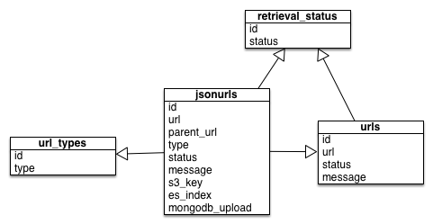

# Data Ingest

## Data Sources

Most of the data sources for Semantic Health are from the [CMS.gov Public Use Files](https://www.cms.gov/CCIIO/Resources/Data-Resources/marketplace-puf.html) and are the data dictionaries and Public Use Files available on that site. The PUF of primary interest is the [Machine Readable URL PUF](http://download.cms.gov/marketplace-puf/2016/machine-readable-url-puf.zip). The MRURL PUF contains a row for each state and insurance provider with the URL to a JSON file that points to the Plans, Providers and Formularies. This is the source of the physicians, addresses, plans for which they are in-network and accepting patients and more. The Formularies contain the drugs that are covered in the plans, and the Plan JSON files contain the plan attributes.

These files are updated every 30 days.

Other sources of data include scraping drugs.com from drug names and disease names and SmartyStreets for geolocation data from addresses.

## Data Ingest

Data from the CMS.gov Machine Readable URL PUF is partially processed in the example code found in the iPython notebook `S3.ipynb`. This notebook has example code that reads a JSON file from the provided URL and then follows the links in the JSON to the Provider, Plan and Formulary JSON documents. These documents in turn are streamed to local files then transferred to S3. This prevents having to traverse the network to re-ingest data as we work through different representations and indexing strategies. The Python `boto3` module is used to store the data to AWS S3 but neither it nor S3 are able to take the downloaded stream directly for input, so therefore the file has to be downloaded to local disk first then transferred to S3.

The Machine Readable URL PUF contains approximately 36K URLs that must be followed to get all the data for all the states that participate in the national ACA exchange at Healthcare.gov.

### Data Issues

Inspection of the JSON data is reasonable enough - except that none of the JSON documents contain any of the metadata for state or other aspects. Since each row in the top level Machine Readable URL PUF corresponds to a state and an insurer for that state the state information is external to the JSON.

While the JSON documents are well structured, the data within them is not. Many of the ultimate `plan.json`, `provider.json` or `formulary.json` files are split out by state and plan, but there is no way to tell. Therefore care must be taken to track what has been seen in the data ingest to avoid data duplication.

### JSON URL examples

The basic hierarchy of the machine readable JSON files is shown in the following diagram and described in the [Machine Readable Data Dictionary](https://www.cms.gov/CCIIO/Resources/Data-Resources/Downloads/Machine_Readable_Data_Dictionary.pdf)

An example of the JSON hierarchy goes something like this: *All information is fictional and for illustrative purposes only*

	|
	|- State AK, Insurer Moda, https://get-moda.com/json/cms.json
	|
	|---- Formulary : http://get-moda.com/json/formulary-AK.json, http://get-moda.com/json/formulary-OR.json
	|---- Provider  : http://get-moda.com/json/providers-AK.json, http://get-moda.com/json/providers-AK.json
	|---- Plans     : http://get-moda.com/json/plans-AK.json, http://get-moda.com/json/plans-OR.json
	|
	|- State OR, Insurer Moda, https://get-moda.com/json/cms.json
	|
	|---- Formulary : http://get-moda.com/json/formulary-AK.json, http://get-moda.com/json/formulary-OR.json
	|---- Provider  : http://get-moda.com/json/providers-AK.json, http://get-moda.com/json/providers-AK.json
	|---- Plans     : http://get-moda.com/json/plans-AK.json, http://get-moda.com/json/plans-OR.json
	|	
	|- State VA, Insurer MetLife, https://met-life.com/json/met-life.json
	|
	|---- Formulary : http://met-life.com/json/formulary1.json, http://met-life.com/json/formulary2.json
	|---- Providers : http://met-life.com/json/providers1.json, http://met-life.com/json/providers2.json
	|---- Plans     : http://met-life.com/json/plans.json

Here you see that Moda has two states, OR and AK, and for both states they provide the same set of files. In this case they name the JSON with the state as part of the URL, but that is rare.

The Met-Life example shows how multiple files can be used for the information in the one state, which may or may not contain information from other states. Most of the time they don't but there is no metadata that tells us this.

### Tracking Data Ingest

A PostgreSQL instance is used to track the state of the downloads and their relative processing states. As JSON files are downloaded by traversal of the Machine Readable PUF their structure is tracked in a set of tables.

The `urls` table is the equivalent of the Machine Readable PUF CSV files while the `jsonurls` table contains the intermediate level URLs for the plans, providers and formularies. The `s3key` field of the `jsonurls` table tracks the S3 blob that contains the leaf node JSON.

### List of Sources

| File | Description and Use
| ---- | -------------------
| [machine-readable-url-puf.xlsx](http://download.cms.gov/marketplace-puf/2016/machine-readable-url-puf.zip) | The root source of all JSON data files used for plans, providers and formularies. The URLs are loaded into the `urls` table in PostgreSQL and traversed, filling in the `jsonurls` table as each JSON file is downloaded and stored on AWS S3.
| [network-puf.csv](http://download.cms.gov/marketplace-puf/2016/network-puf.zip) | Insurer network identifiers for each insurer by state. This file was not used.
| [plan-attributes-puf.csv](http://download.cms.gov/marketplace-puf/2016/plan-attributes-puf.zip) | The attributes of plans, This file is loaded into the `plan_attributes` table in PostgreSQL and is one of the core tables used to generated the Elasticsearch index.
| [Benefits-and-cost-sharing-puf.csv](https://www.cms.gov/cciio/resources/data-resources/marketplace-puf.html#) | Plan benefits, co-pay schedules and conditions for insurance plans. This file is loaded into the PoastgreSQL `benefits_and_cost_sharing` table and used to populate some of the plan data for the UI.
| [Rate-PUF.csv](https://www.cms.gov/cciio/resources/data-resources/marketplace-puf.html#) | Plan rate schedules, including age ranges, smoker or non-smoker, family sizes, etc. and the cost factors associated with those attributes. This table is loaded into the `rates` PostgreSQL table and joined with other tables to generate the data for the Elasticsearch index.
| [2015-Q3-HIOS.xlsx](https://www.cms.gov/CCIIO/Resources/Data-Resources/Downloads/2015-Q3-HIOS.xlsx) | Insurer information such as legal and marketing names. This file is loaded into the `HIOS_INSURER` table in PostgreSQL and joined with other tables to populated the Elasticsearch index
| Insurer Logos | (Generated) web scraping of insurer logo URLs for use in the UI. This data is generated from scraping the web and loading the data into the `logos` table in PostgreSQL. The table is joined with other insurer information to create the Elasticsearch index.
| Aggregated Plan Rates | (Generated) Data computed from the rate plan files for quartile information on plans and plan types. This is loaded into a PostgreSQL table and used as part of the plan data in the Elasticsearch index.
| Rxnorm_by_disease | A generated set of Rxnorm drug identifiers commonly used in the treatment of particular diseases. Used to help find plan formularies that cover chronic conditions and diseases.

### MongoDB 

In order to facilitate the querying of the JSON data the JSON documents themselves are loaded from S3 to a MongoDB instance. There is a separate database for each of the `provider`, `plan`, and `formulary` JSON documents, with a corresponding collection that contains the actual data. Only the `provider` database contains more than one collection as the `provider` data contains two entities: `provider` and `facility`. The MongoDB instance makes it very easy to query the JSON data and establish indexed to make querying the data efficient.

| Database | Collection |  Description
| -------- | ---------- | ------------
| plans | plans | Insurance plan information: benefits, tiers, formulary and plan brochure links
| formularies | drugs | Formularies are the set of drugs covered by a plan, so each entry is a list of RxNorm codes and drug names by plan.
| providers | providers | Healthcare provider information: in-network plan information, accepting status, address, speciality, etc.
| providers | facilities | Healthcare facility information: address, plan coverage, etc.

## Elasticsearch

The Elasticsearch index has undergone a number of revisions in order to find the best combination of fast lookups and reasonable data sizes. The Elasticsearch index is dictated by a specific mapping with some custom analyzers specified. The data that is loaded into the Elasticsearch index is built from a comnbination of the data in the PostgreSQL database and MongoDB. The parameters and mappings for the index are replicated here for reference but the file is located under the `elasticsearch` portion of the repository.

### Elasticsearch Index Structure

We use a custom analyzer for many of the fields in order to make the best use of resources for the purpose at hand. The `plan_rank_00` fields are the plan ranks that are updated as part of the LETOR processing. As more dimensions are added to the rank vector more fields are added dynamically.

    {"settings": {
        "number_of_shards": 4,
        "number_of_replicas": 1,
        "refresh_interval": "10",
        "index": {
          "analysis": {
            "analyzer": {
              "simpleAnalyzer": {
                "type": "custom",
                "tokenizer": "customTokenizer1"
              }
            },
            "tokenizer": {
              "customTokenizer1": {
                "type": "lowercase"
              }
            }
          }
        }
      },
      "mappings": {
        "plan": {
          "properties": {
            "issuer": {
              "type": "string",
              "index": "analyzed",
              "fields": {
                "raw": {
                  "type": "string",
                  "index": "not_analyzed"
                }
              }
            },
            "level": {
              "type": "string",
              "fields": {
                "raw": {
                  "type": "string",
                  "index": "not_analyzed"
                }
              }
            },
            "url": {
              "type": "string",
              "index": "no"
            },
            "logo_url": {
              "type": "string",
              "index": "no"
            },
            "state": {
              "type": "string",
              "index": "not_analyzed"
            },
            "plan_name": {
              "type": "string"
            },
            "plan_type": {
              "type": "string",
              "fields": {
                "raw": {
                  "type": "string",
                  "index": "not_analyzed"
                }
              }
            },
            "premiums_median": {
              "type": "float"
            },
            "premiums_q1": {
              "type": "float",
              "index": "no"
            },
            "premiums_q3": {
              "type": "float",
              "index": "no"
            },
            "drugs": {
              "type": "string",
              "analyzer": "simpleAnalyzer"
            },
            "conditions": {
              "type": "string",
              "fields": {
                "raw": {
                  "type": "string",
                  "index": "not_analyzed"
                }
              }
            },
            "providers": {
              "type": "nested",
              "properties": {
                "provider_name": {
                  "type": "string",
                  "analyzer": "simpleAnalyzer"
                },
                "specialities": {
                  "type": "string",
                  "analyzer": "simpleAnalyzer"
                },
                "npi": {
                  "type": "string",
                  "index": "no"
                }
              }
            },
            "plan_rank_0": {
              "type": "float"
            },
            "plan_rank_1": {
              "type": "float"
            },
            "plan_rank_2": {
              "type": "float"
            },
            "plan_rank_3": {
              "type": "float"
            },
            "plan_rank_4": {
              "type": "float"
            },
            "plan_rank_5": {
              "type": "float"
            },
            "plan_rank_6": {
              "type": "float"
            },
            "plan_rank_7": {
              "type": "float"
            },
            "plan_rank_8": {
              "type": "float"
            },
            "plan_rank_9": {
              "type": "float"
            }
          }
        }
      }
    }

## Overall Data Ingest Diagram

This diagram illustrates the overall flow of the data ingest processing.

Each of the orange cubes labeled `Processor` are Python programs to transform and load data.

