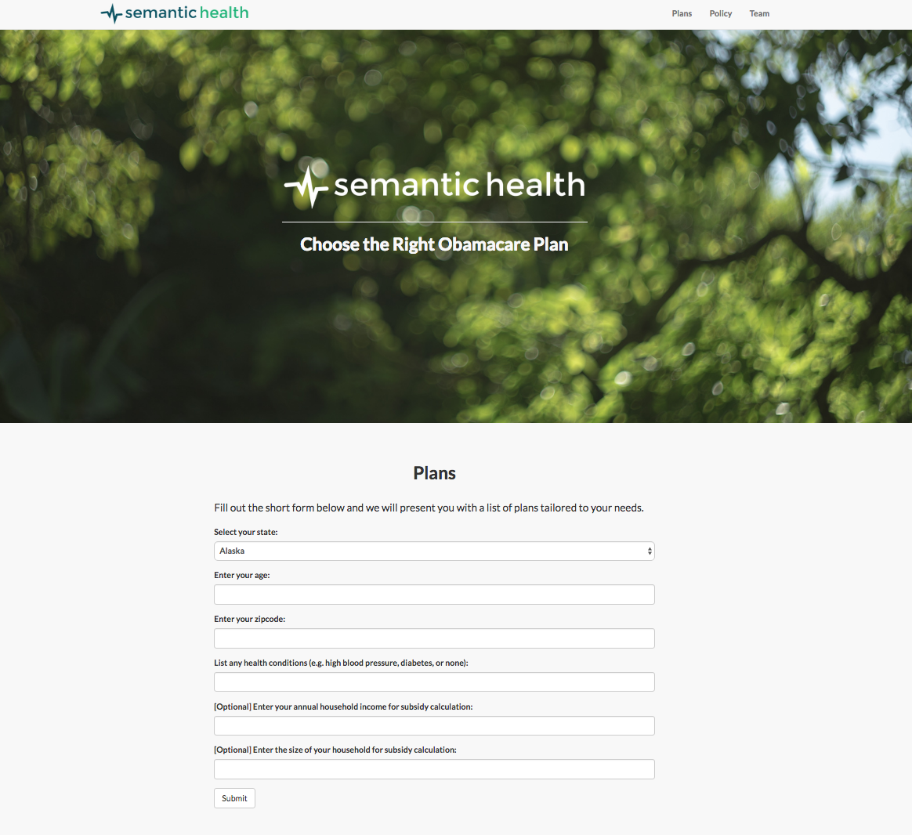

# ACA Capstone Project Web Development

### Components
1. Flask backend (python web framework)
2. React frontend (single page app via searchkit)
3. Elasticsearch scripts (loading data)

See the README's for `flask-backend` and `react-frontend` for more details.

### Home Page

The user enters their information into a short form, which we use to present a list of plans tailored to their needs. The form data is logged in a PostgreSQL database with a unique session id.

### Results Page

The user can further search and filter the list of returned plans, which are ranked by a Learn-to-Rank (LETOR) algorithm. The clickstream data is sent to the Flask server and saved in the PostgreSQL database.
